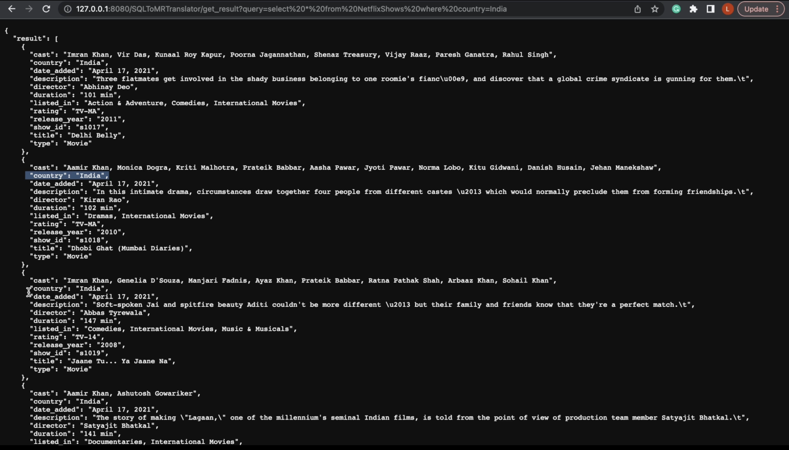

<h1 align="center">SQLToMRJobTranslator</h1>

SQLToMRJob Translator is a REST-API service that translates the SQL queries into MapReduce jobs and executes those jobs on the AWS EMR cluster using hadoop-streaming.jar and returns the results to the user.

The [Netflix](https://www.kaggle.com/datasets/shivamb/netflix-shows) dataset has been taken to build and test the system, but it can support other datasets as well by updating the /config/config.yaml file.

## Requirements
Python >= 3.0
Paramiko
AWS EMR Cluster
Update config.yaml and schema.yaml contents

## Query Template
SELECT <COLUMNS> FROM TABLENAME WHERE <COLUMN> = X;

## Demo:
select * from NetflixShows where country = "India" 

## Limitation
Supports basic SQL SELECT queries with and without WHERE clause.
